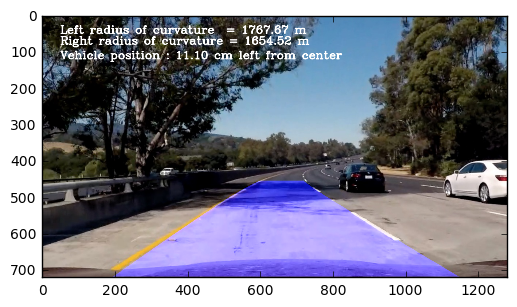

**Advanced Lane Finding Project**

The goals / steps of this project are the following:

* Compute the camera calibration matrix and distortion coefficients given a set of chessboard images.
* Apply a distortion correction to raw images.
* Use color transforms, gradients, etc., to create a thresholded binary image.
* Apply a perspective transform to rectify binary image ("birds-eye view").
* Detect lane pixels and fit to find the lane boundary.
* Determine the curvature of the lane and vehicle position with respect to center.
* Warp the detected lane boundaries back onto the original image.
* Output visual display of the lane boundaries and numerical estimation of lane curvature and vehicle position.

[//]: # (Image References)

[image1]: ./pics_for_README/undistortion.png "Undistorted"
[image2]: ./pics_for_README/undistort_image.png "Road Transformed"
[image3]: ./pics_for_README/white_line_detection.png "Binary Example of White Line"
[image4]: ./pics_for_README/yellow_line_detection.png "Binary Example of Yellow Line"
[image5]: ./pics_for_README/sobel_thresh.png "Sobel X"
[image6]: ./pics_for_README/color_edge.png "Color Edge"
[image7]: ./pics_for_README/gaussianblur.png "Gaussian Blur"
[image8]: ./pics_for_README/warped.png "Warped image"
[image9]: ./pics_for_README/left_right_lane.png "Left Right Lane"
[image10]: ./pics_for_README/polyfit.png "2nd order polynomial fit"
[image11]: ./pics_for_README/plot_back.png "Plot Back"


---


###Camera Calibration

####1. Camera matrix and distortion coefficients.

Image distortion occurs when a camera looks at 3D objects in the real world and transforms them into 2D image. This transformation isn't perfect(different size or shape). Therefore we have to undistort the image. By undistorting image, we can get correct and more useful information from an image.


I start by preparing "object points", which will be the (x, y, z) coordinates of the chessboard corners in the world. Here I am assuming the chessboard is fixed on the (x, y) plane at z=0, such that the object points are the same for each calibration image.  Thus, `objp` is just a replicated array of coordinates, and `objpoints` will be appended with a copy of it every time I successfully detect all chessboard corners in a test image.  `imgpoints` will be appended with the (x, y) pixel position of each of the corners in the image plane with each successful chessboard detection.


The code for this step is contained in the first code cell of the IPython notebook located in ".Camera_Calibration.ipynb".

I then used the output `objpoints` and `imgpoints` to compute the camera calibration and distortion coefficients using the `cv2.calibrateCamera()` function.  I applied this distortion correction to the test image using the `cv2.undistort()` function and obtained this result:

The code for this step is contained in the second code cell(undistort chess board image) of the IPython notebook located in ".Camera_Calibration.ipynb".

![Image undistortion][image1]

###Pipeline (single images)

####1. Distortion-corrected image.
I applied the camera matrics and distortion coefficient,which are calculated above, to the test images and the result looks like this(Left:Original image Right:Undistorted image):
![alt text][image2]

####2. Color transforms, Gradients to create a thresholded binary image.

I used a combination of color and gradient thresholds to generate a binary image


First I get white line and yellow line by using RGB to HSV color transformation.
The threshold of the HSV is as follows.

| Color Space | White Line    | Yellow Line   |
|:---------:  |:-------------:|:-------------:|
| H low       | 4             | 18            |
| H high      | 255           | 80            |
| S low       | 0             | 80            |
| S high      | 32            | 255           |
| V low       | 207           | 0             |
| V high      | 255           | 255           |

The binary image of the white and yellow line are below.
![White Line][image3]
![Yellow Line][image4]

The procedure in this process is in the section 7 ~ 9 of EDA.ipynb

I also used Edge detection by Sobel x operator.
I utilized HLS color space (S spece) and used kernel size of 13 and min threshold to 90 ans max threshold to 225
The procedure in this process is in the section 1 of EDA.ipynb

```
sobel = cv2.Sobel(img,cv2.CV_64F,1,0,ksize=13 ,thresh_min=90, thresh_max=225)
```

The binary image of sobel x thresholding is below.
(I apply the sobel x to the original image,not transformed ones,so that we can see the entire image of sobel x effect.)


![Sobel X][image5]


Then I put it together.
(Section 10 of EDA.ipynb)


![Color Edge][image6]

Finally I apply Gaussian Blur so that the detected lines area are enlarged.
(Section 10.1 of EDA.ipynb)


![Gaussian Blur][image7]


####3. Perspective transform

The code for my perspective transform includes a function called `warp()`, which appears in the section 6 of EDA.ipynb.  The `warp()` function takes as inputs an image (`img`) and returns the transformed image,transformation matrics and inverse transformation matrics. I chose the hardcode the source and destination points in the following manner:

```
 src = np.float32(
    [[585. /1280.*img_size[0], 455./720.*img_size[1]],
    [705. /1280.*img_size[0], 455./720.*img_size[1]],
    [1120./1280.*img_size[0], 720./720.*img_size[1]],
    [190. /1280.*img_size[0], 720./720.*img_size[1]]])

dst = np.float32(
    [[300. /1280.*img_size[0], 100./720.*img_size[1]],
    [1000./1280.*img_size[0], 100./720.*img_size[1]],
    [1000./1280.*img_size[0], 720./720.*img_size[1]],
    [300. /1280.*img_size[0], 720./720.*img_size[1]]])
```
This resulted in the following source and destination points:

| Source        | Destination   |
|:-------------:|:-------------:|
| 585, 455      | 300, 0        |
| 705, 455      | 1000, 0       |
| 1120, 720     | 1000, 720     |
| 190, 720      | 300, 720      |

I verified that my perspective transform was working as expected by drawing the `src` and `dst` points onto a test image and its warped counterpart to verify that the lines appear parallel in the warped image.

![Warped image][image8]

####4. Lane-line pixels and fit their positions with a polynomial

Until here, I've got binary image of lanes.Therefore, from here, I'll discuss how I identified lane line pixels and fit their positions with a polynomial.

First I divied the image into 11 frames from top to bottom.
Then, I take the moving average to the binary image of each frame. "1" means the pixel is white and "0" means the pixel is black. After calculating moving average, I find the peaks of the histogram by using find_peaks_cwt. if the peaks are more than 2, I set the small number of them to the Left lane pixel and large number of them to the Right lane pixel. If only one peak is found, I have to decide that one peak exists in left or right lane. If no peaks are found, I used the previous lane pixel as the lane pixel. If the difference between the current peak location and previous peak location is more than 80 picels, I set the current peak as the previous peak(no update). Finally, I set window size as 40. (Section 12 of EDA.ipnb)

![Left and Right Lanes][image9]

After getting left and right lanes, I set threshold again to each lane to find the better position. As for the left lane, I set threthold as 0.3 and for the right lane, 0.3. Thus I got the lane pixels. To prevent detecting anomally pixels(anomally location), I chose 5 to 90 percentile of the pixels from the left and 1 to 95 percentiles of the pixels from the right. Finally, I got the x and y lane pixels from the image, So from these points, I fit second order of polynomial fit.(Section 13 of EDA.ipynb)


![2nd order of polynomial fit][image10]

####5. Radius of curvature and vehicle position


The radius of the curvature is computed as following. The picture is in pixel value, so we have to transform it in meter scale.

```
ym_per_pix = 30/720 # meters per pixel in y dimension
xm_per_pix = 3.7/700 # meteres per pixel in x dimension
```

Here, all_x and all_y is the pixels where lane line exists.
I fitted polynomial fit on the meter scale and then I calculated the curvature as in lecture as follows .
```
left_fit_cr = np.polyfit(all_x*ym_per_pix, all_y*xm_per_pix, 2)
y_eval = np.max(all_x)
left_curverad = ((1 + (2*left_fit_cr[0]*y_eval + left_fit_cr[1])**2)**1.5) \
/np.absolute(2*left_fit_cr[0])
```

I also calculated the vehicle position. I assume that the camera is on the center of the car. By calculating the average of left lane and right lane position, we can get the position of the car.

```
middle = (left_fitx[-1] + right_fitx[-1])//2
veh_pos = img_size[0]//2
dist_offset =100* (veh_pos - middle)*xm_per_pix # Positive means the car is  on  the right side , Negative means on left

```


####6. Provide an example image of your result plotted back down onto the road such that the lane area is identified clearly.

I've found lane lines so far. The lane lines are in the transformed image so I have to retransform it into the original image. I implemented this step in the section 14 in EDA.ipynb


![Plot Back][image11]

---

###Pipeline (video)

The output of the pipeline is below.

[](https://youtu.be/ZgajSY3k8IA)

---

###Discussion

In this project, I searched lane lanes from the image.
The procesure is as follows.
First, I calculated camera matrics and distortion coefficients to undistort image. Then I use several techniques to find lane lines. Firstly, I transform the color space from RGB to HSV to find white and yellow lines. Then I used sobel operation to detect edges. Finally I put it together and then used gaussian blur to find the lane lines easily.

The procedure above may fail to detect lines when there are lines apart from lanes such as crosswalk. To prevent miss detection, I should keep the information of the lane lines so that I can keep track of the lanes.

#### Reference
https://medium.com/@vivek.yadav/robust-lane-finding-using-advanced-computer-vision-techniques-mid-project-update-540387e95ed3#.pusofywkb